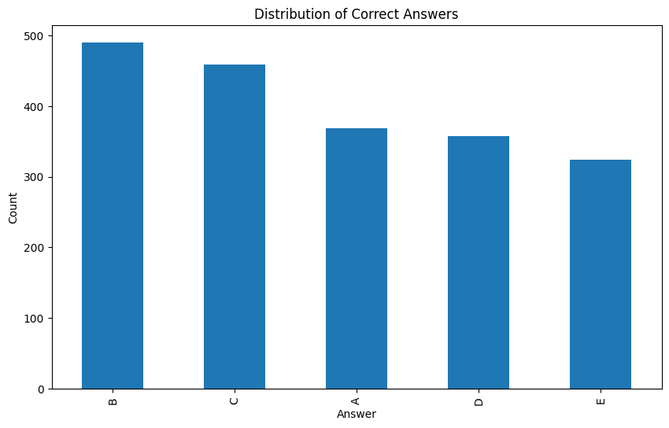

# Smart MCQ Solver Challenge - Milestone 1: NLP Foundation & Semantic Similarity

## Project Overview

Smart MCQ Solver Challenge is a machine learning competition where the goal is to build AI systems that can predict the top 3 most probable correct answers for challenging multiple-choice questions, ranked by confidence.

Milestone 1 Focus: Building foundational NLP pipelines using traditional and modern embedding techniques to understand semantic similarity between questions and answer options.


## Milestone 1 Objectives

This milestone covers the essential NLP fundamentals required for MCQ solving:


* Text Preprocessing: Clean, tokenize, and prepare raw MCQ data
* Embedding Generation: Create numerical representations using TF-IDF and Word2Vec
* Semantic Similarity: Compute cosine similarity to match questions with options
* Evaluation Metrics: Calculate Mean Average Precision @ 3 (MAP@3)
* Data Analysis: Understand dataset characteristics and answer distributions


## Dataset Analysis

* Training Dataset Statistics

```
Total Samples:           2,000 questions
Test Samples:            500 questions
Duplicate Questions:     183 (9.15%)
Columns:                 id, prompt, A, B, C, D, E, answer

Missing values in training dataset:
id        0
prompt    0
A         0
B         0
C         0
D         0
E         0
answer    0
dtype: int64

Missing values in testing dataset:
id        0
prompt    0
A         0
B         0
C         0
D         0
E         0
dtype: int64

Training Dataset Answer Distribution:
...
B: 490 samples (24.5%) <= Most common
C: 459 samples (23.0%)
A: 369 samples (18.5%)
D: 358 samples (17.9%)
E: 324 samples (16.2%) <= Least common

Key Insight: Answer distribution is biased! B and C are 50% more likely than E. This baseline knowledge helps models when uncertain.
```



* Common questions prefixes:
```
Common questions prefixes:
prompt
Identify the correct statement: What is the relati -> 22
Choose the correct answer: Which of the following -> 21
Pick the best possible answer: What is the reason -> 19
Identify the correct statement: What is the signif -> 18
Pick the best possible answer: What is the relatio -> 18
Determine the correct option: What is the relation -> 18
Select the most accurate option: What is the reaso -> 18
Which of the following is correct? What is the rel -> 17
Select the most accurate option: What is the relat -> 17
Which of the following is correct? What is the rea -> 16

Questions with very similar options (unique_prefixs <3):
 -> 1078
```
### 1078 out of 2000 (54%) have very similar option prefixes ; Means
* Simple keyword matching will FAIL 
* Need semantic understanding, not just text overlap
* This is why pretrained transformers (Model 2) will shine


* Text statistics
```
Prompt Length:
  Mean: 117.67 characters
  Std:  44.41 characters
  Min:  19, Max: 337

Option Length:
  Mean: 164-167 characters (all options similar)
  Std:  99-136 characters
  Min:  1, Max: 662
```

```
Overlapping prompts: 0 (should be 0!)
Train: 1576, validation: 424
```

## Key Decisions
|Decision| Reason|
|:--|:--|
|Remove prefixes| They're noise, don't add semantic value|
|Lowercase | Better for embedding consistency|
|Keep special chars| Scientific notation matters (10^-12, π, etc.)|
|GroupShuffleSplit|Prevent data leakage from duplicate questions|
|Stratified split|Maintain answer distribution|

* Below is cleaning and prompt & options concatination code
```
from sklearn.model_selection import train_test_split
from sklearn.model_selection import GroupShuffleSplit

def clean_prompt(prompt):
    # remove standardized prefixes
    if (':' in prompt) or ('?' in prompt):
        if ':' in prompt:
            sep_prompt= prompt.strip().split(':')
            return ':'.join(sep_prompt[1:]).strip()
        if '?' in prompt:
            sep_prompt= prompt.strip().split('?')
            return '?'.join(sep_prompt).strip()
    return prompt

# Reduces noise in TF-IDF features
# Shorter sequences for BERT (fits more context in 512 tokens)
# Models focus on actual question content

train_df['prompt']= train_df['prompt'].apply(clean_prompt)
test_df['prompt']= test_df['prompt'].apply(clean_prompt)

# ************************* Train/Validate split *********************
# train_data, val_data= train_test_split(train_df, test_size= 0.2, random_state=42, stratify= train_df['answer']) # keep answer distribution
train_df['prompt_group']= train_df['prompt'].factorize()[0]
splitter= GroupShuffleSplit(n_splits=1, test_size=0.2, random_state=42)

for train_idx, val_idx in splitter.split(train_df, groups= train_df['prompt_group']):
    train_data= train_df.iloc[train_idx].reset_index(drop=True)
    val_data= train_df.iloc[val_idx].reset_index(drop=True)
    break # only one split

# verify no leakage
train_prompts= set(train_data['prompt'].unique())
val_prompts= set(val_data['prompt'].unique())
overlap= train_prompts & val_prompts
print(f"Overlapping prompts: {len(overlap)} (should be 0!)")


print(f"Train: {len(train_data)}, validation: {len(val_data)}")


# def clean_text(text):
#     # Usually not needed for modern models, but consider:
#     text = text.strip()
#     # Don't lowercase if using pretrained models (they expect proper case)
#     return text

# ***************************** Label Encoder ***********************
label_map= {"A":0, "B":1, "C":2, "D":3, "E":4}
train_data['label']= train_data['answer'].map(label_map)
val_data['label']= val_data['answer'].map(label_map)


# # **************************** combine question and options *******************
# Combine question + all options into one text

def ceate_text_feature(row):
    return f"{row['prompt']} [SEP] A: {row['A']}, B: {row['B']}, C: {row['C']}, D: {row['D']}, E: {row['E']}"

train_data['combined_text']= train_data.apply(ceate_text_feature, axis=1)
val_data['combined_text']= val_data.apply(ceate_text_feature, axis=1)
test_df['combined_text']= test_df.apply(ceate_text_feature, axis=1)

```


# Part 2: Embedding Generation
Method 1: TF-IDF (Term Frequency - Inverse Document Frequency)

Concept:
Represents how important each word is to a document relative to the entire corpus
Common words get low weight, rare words get high weight
Fast, interpretable, works well for keyword matching

```
# **************************** Feature extraction ************************************** 
# convert text to tf-idf vectors
vectorizer= TfidfVectorizer(
    max_features=5000, # limited vocabulary
    ngram_range=(1,2), # unigram and bigram
    min_df= 2 # ignore rare words
    
)

X_train= vectorizer.fit_transform(train_data['combined_text'])
X_val= vectorizer.transform(val_data['combined_text'])
y_train= train_data['label'].values
y_val= val_data['label'].values

X_test= vectorizer.transform(test_df['combined_text'])

print(f"Feature Shape: {X_train.shape}")


```

## Part 3: After embedding built a base model using simple ANN.

```
model= Sequential([
    Input(shape= (X_train.shape[1],)),
    Dense(256, activation='relu'),
    Dropout(0.3),
    Dense(128, activation='relu'),
    Dropout(0.3),
    Dense(5, activation='softmax') # classes: A, B, C, D, E    
])


model.compile(optimizer='adam', loss='sparse_categorical_crossentropy', metrics=['accuracy'])

model.summary()


# Gave score -> 0.74
```

* And Cosine Similarity Computation
```
# ========================================== COMPUTE SIMILARITY FOR EACH VALIDATION QUESTION ===========================

predictions_tfidf=[]
similarities_debug=[]
top3_ans_pred=[]
top3_ans_as_result=[]

for idx in range(X_test.shape[0]):
    # Get validation text vector
    test_vec= X_test[idx].reshape(1,-1).toarray()

    # compute similarity with all training vectors
    similarities= cosine_similarity(test_vec, X_train)[0]

    # Get top 3 most similar training example
    top3_indices= np.argsort(similarities)[-3:][::-1]
    top3_scores= similarities[top3_indices]

    predictions_tfidf.append(top3_indices)
    similarities_debug.append(top3_scores)

    top3_ans= [train_df.iloc[index]['answer'] for index in top3_indices]
    top3_ans_pred.append(top3_ans)

    join_top3_ans= ''.join(top3_ans)
    top3_ans_as_result.append(join_top3_ans)
top3_ans_as_result
```

* WORD2VEC COSINE SIMILARITY

```
#************************************** WORD2VEC COSINE SIMILARITY ********************************
import gensim.downloader as api

print("\nLoading pretrained Word2Vec embeddings...")

try:
    word_vectors = api.load("word2vec-google-news-300")
    embedding_dim = 300
    print(f"Loaded Word2Vec-300 ({embedding_dim} dimensions)")
except:
    print("Could not load Word2Vec, using FastText instead")
    word_vectors = api.load("fasttext-wiki-300")
    embedding_dim = 300
    print(f"Loaded FastText-300 ({embedding_dim} dimensions)")
 
def get_embedding(text, word_vectors, embedding_dim=300):
    """
    Convert text to embedding by averaging word vectors
    
    This is the KEY step for semantic understanding!
    """
    words = text.lower().split()
    vectors = []
    
    for word in words:
        try:
            # Get vector for this word
            vectors.append(word_vectors[word])
        except KeyError:
            # Word not in vocabulary, skip
            continue
    
    if len(vectors) == 0:
        # No words found, return zero vector
        return np.zeros(embedding_dim)
    
    # Average all word vectors
    embedding = np.mean(vectors, axis=0)
    return embedding

# ========== COMPUTE EMBEDDINGS FOR ALL DATA ==========
 
print("\nGenerating Word2Vec embeddings...")
 
# For training data
train_embeddings = np.array([
    get_embedding(text, word_vectors, embedding_dim)
    for text in train_df['prompt'].tolist()
])

print(f"Training embeddings: {train_embeddings.shape}")


# For test data
test_embeddings = np.array([
    get_embedding(text, word_vectors, embedding_dim)
    for text in test_df['prompt'].tolist()
])
 
print(f"Validation embeddings: {test_embeddings.shape}")


def compute_word2vec_option_similarity(test_df):

    predictions = []
    similarities_prob = []


    for idx in range(len(test_df)):
        row= test_df.iloc[idx]

        # get question embedding
        question_embedding= test_embeddings[idx]


        # get embedding fore all 5 options

        option_embeddings = np.array([
            get_embedding(row['A'], word_vectors, embedding_dim),
            get_embedding(row['B'], word_vectors, embedding_dim),
            get_embedding(row['C'], word_vectors, embedding_dim),
            get_embedding(row['D'], word_vectors, embedding_dim),
            get_embedding(row['E'], word_vectors, embedding_dim)
        ])  # Shape: (5, 300)

        # Reshape question for cosine_similarity
        q = question_embedding.reshape(1, -1)  # (1, 300)
        o = option_embeddings.reshape(5, -1)    # (5, 300)

        # ========== COSINE SIMILARITY COMPUTATION ==========
        # THIS IS THE KEY STEP!
        
        similarities = cosine_similarity(q, o)[0]  # Shape: (5,)

      # ========== RANK OPTIONS BY SIMILARITY ==========
        
        # Get indices of top 3 most similar options
        # argsort gives smallest to largest, [::-1] reverses to largest first
        top3_indices = np.argsort(similarities)[-3:][::-1]  # [idx_best, idx_2nd, idx_3rd]
        
        # Convert indices to letters
        index_to_letter = {0: 'A', 1: 'B', 2: 'C', 3: 'D', 4: 'E'}
        top3_letters = [index_to_letter[i] for i in top3_indices]


       # Get scores for these top 3
        top3_scores = similarities[top3_indices]

        predictions.append(' '.join(top3_letters))
        similarities_prob.append(top3_scores)

    return predictions, similarities_prob

ans, _= compute_word2vec_option_similarity(test_df)
ans
```

## Part 4: MAP@3 (Mean Average Precision @ 3)

* Concept

What is MAP@3 ? For each question, calculate precision if the correct answer appears in top 3:

```
If correct answer is A:

Prediction [A, B, C]:  AP = 1/1 = 1.0    (perfect!)
Prediction [B, A, C]:  AP = 1/2 = 0.5    (2nd position)
Prediction [B, C, A]:  AP = 1/3 = 0.333  (3rd position)
Prediction [B, C, D]:  AP = 0.0          (not in top 3)
```
Implementation:
```
def calculate_map3(predictions, ground_truth):
    """
    Calculate Mean Average Precision @ 3
    
    predictions: list of lists [[pred1, pred2, pred3], ...]
    ground_truth: list of correct answers ['A', 'B', ...]
    
    Returns: float between 0 and 1
    """
    scores = []
    
    for preds, truth in zip(predictions, ground_truth):
        if truth in preds:
            # Calculate position (1-indexed)
            position = preds.index(truth) + 1
            # AP = 1 / position
            ap = 1.0 / position
        else:
            # Correct answer not in top 3
            ap = 0.0
        
        scores.append(ap)
    
    # Mean Average Precision
    map3 = np.mean(scores)
    
    return map3
```

